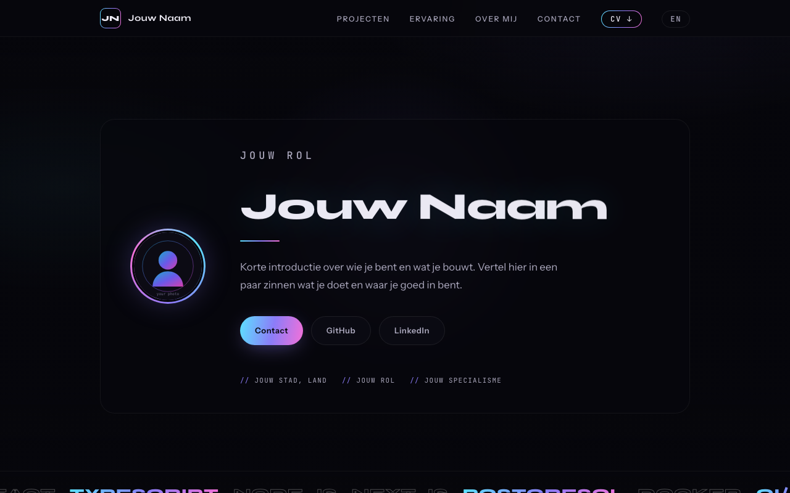

# Signal — portfolio template

A fast, single-page **portfolio template** with an animated WebGL background, a
bilingual setup, and a downloadable CV. No build step, no framework, no
dependencies to install — just static HTML/CSS/JS plus [Three.js](https://threejs.org)
loaded from a CDN.

> Built to be filled in: swap the text, drop in your own 3D scene, replace a few
> images, and deploy anywhere that serves static files.

**[▶ Live demo](https://stijntimmerman.github.io/portfolio-template/)**



## Features

- 🎛 **Swappable 3D background** — the whole Three.js scene lives in one file
  (`scene.js`) behind a tiny `CONFIG` + a single `buildScene()` function. Replace
  it with anything; the renderer, resize, scroll, pointer-parallax,
  reduced-motion and WebGL-fallback plumbing keeps working.
- 🌍 **Bilingual** — primary language in `index.html`, a second language under
  `/en`, with a language switcher. Remove `/en` for a single-language site.
- 📄 **Downloadable CV** — designed in HTML (`cv-src/`), rendered to PDF.
- ♿ **Respects `prefers-reduced-motion`** and degrades gracefully without WebGL.
- 📱 Responsive, with lighter rendering on small screens.
- ⚡ **Zero build** — open the file or serve the folder.

## Quick start

Click **“Use this template”** on GitHub (or clone), then preview locally:

```bash
python3 -m http.server 8000
# open http://localhost:8000
```

That's it — there is nothing to compile.

## Customize

### 1. Your content
Edit `index.html` (primary language) and `en/index.html` (second language).
Replace the placeholders: name, role, bio, the three project cards, contact
links, and the `<head>` metadata + JSON-LD. For a single-language site, delete
the `en/` folder and the language switcher.

### 2. The 3D background — `scene.js`
Two things to touch:
- **`CONFIG`** at the top — background color, fog, bloom strength, accent colors,
  particle count.
- **`buildScene(scene, camera, opts)`** — add your meshes/points and return an
  object with an `update(time, scroll, pointer)` callback. `scroll` is page
  progress `0..1`; `pointer` is the smoothed cursor (`-1..1`). Everything else is
  boilerplate you can ignore.

Three.js is loaded via an import map in `index.html`, so `import * as THREE from
"three"` works with no bundler.

### 3. Colors & type
The palette and fonts are CSS custom properties in the `<style>` block of
`index.html` (cyan → violet → magenta gradient by default). Keep `scene.js`'s
`CONFIG` colors in sync with your CSS for a cohesive look.

### 4. Images
Replace the placeholders with your own:
- `avatar.svg` — your photo (any format; update the reference if you change the
  extension).
- `og-image.png` — social share card, ideally 1200×630.
- `favicon.svg` — site icon.

### 5. CV download
Edit `cv-src/cv-en.html` / `cv-src/cv-nl.html`, then regenerate the PDFs with
headless Chrome (the `@page { size: A4; margin: 0 }` rule keeps the full-bleed
layout):

```bash
CHROME="/Applications/Google Chrome.app/Contents/MacOS/Google Chrome"  # macOS path
"$CHROME" --headless=new --disable-gpu --no-pdf-header-footer \
  --print-to-pdf="cv-en.pdf" "file://$PWD/cv-src/cv-en.html"
"$CHROME" --headless=new --disable-gpu --no-pdf-header-footer \
  --print-to-pdf="cv-nl.pdf" "file://$PWD/cv-src/cv-nl.html"
```

(Any HTML-to-PDF tool works; `wkhtmltopdf`/`weasyprint` are alternatives.)

## Deploy

It's static, so host it anywhere:

- **GitHub Pages** — Settings → Pages → deploy from branch (root).
- **Netlify / Vercel / Cloudflare Pages** — point at the repo, no build command,
  publish directory = root.
- **Any web server** — copy the folder to the document root. Example Caddy:
  ```
  example.com {
      encode gzip
      root * /var/www/portfolio
      file_server
  }
  ```

## Tech

Vanilla HTML/CSS/JS + Three.js (CDN). No dependencies, no build pipeline.

## License

[MIT](./LICENSE) — free to use, modify and share. Attribution appreciated but not
required.

---

Created by [Stijn Timmerman](https://github.com/StijnTimmerman) — the “Signal” portfolio design, shared as an open template. Attribution appreciated but not required.
